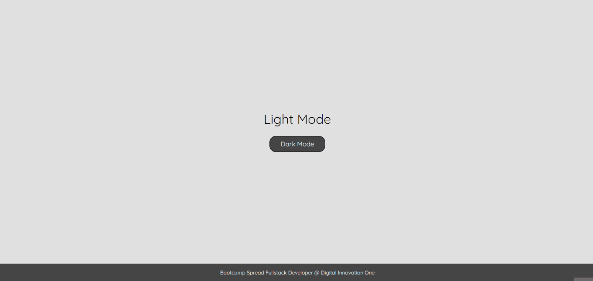

# Projeto Light/Dark Mode

Projeto proposto durante a aula sobre manipulação de elementos do DOM (Document Object Model) com JavaScript do curso de JavaScript do Bootcamp Spread Fullstack Developer proporcionado pela DIO (Digital Innovation One) e patrocinado pela Spread Tecnologia.

